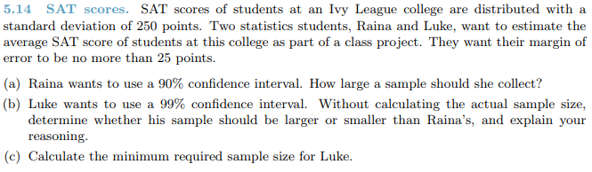

```{r setup, include=FALSE}
knitr::opts_chunk$set(echo = TRUE)
pkgs <- c("tidyverse", "magrittr", "kableExtra")
lapply(pkgs, require, character.only=TRUE)
```

# Questions {.tabset .tabset-fade .tabset-pills}

## 5.6
1. 
```{r 5.6}
n <- 25

# conf interval
ci <- c(65, 77)

# sample mean
smean <- (ci[2]+ci[1]) %>%
  divide_by(2)

# margin of error
me <- (ci[2]-ci[1]) %>%
  divide_by(2)

# standard deviation
p <- .9
p2 <- p + (1-p)/2
t <- qt(p2, n-1)

se <- me/t
sd <- se * sqrt(n)

df <- data_frame(sample_mean = smean, margin_of_error = me, std_dev = sd)

knitr::kable(df, "html") %>%
  kable_styling(bootstrap_options = c("striped", "hover", "condensed", "responsive"))
```


## 5.14
1. 
  * a.)
```{r 5.14a}
# me = z * se
# se = sd/sqrt(n)
# n = (z*sd/me) ^ 2

z <- 1.65
me <- 25
sd <- 250

n <- (((z * sd)/me)^2) %>%
  ceiling %>%
  print
```

  * b.) Luke's sample size should be larger because a higher Z value from the higher confidence interval, making the numerator a lot larger
  * c.)
```{r 5.14c}
# me = z * se
# se = sd/sqrt(n)
# n = (z*sd/me) ^ 2

z <- 2.575
me <- 25
sd <- 250

n <- (((z * sd)/me)^2) %>%
  ceiling %>%
  print
```


## 5.20
1. 
  * a.) There does not seem to be a clear different in the average reading and writing scores. The difference distribution is approximately normal with a center around 0.
  * b.) On a student by student basis, the scores are independent, but within the same student, the scores do not appear to be independent.
  * c.) H0: Mr - Mw = 0; HA: Mr - Mw != 0
  * d.) The difference histogram gives the appearance of dependence, while the box plots show a reasonably normal distribution with no great outliers.
  * e.) The p-value is not less than .05 so there is not enough evidence to reject the NULL.
```{r 5.20e}
avg_diff <- -.545
sd_diff <- 8.887
n <- 200

se <- sd_diff/sqrt(n)

# t value
t <- (avg_diff-0)/se

# p value
p <- pt(t, n-1) %>%
  print
```
  * f.) In this case, since we failed to reject the NULL, we may have incorrectly rejected the alternative hypothesis which would be a Type II error.
  * g.) I would expect the confidence interval for the average difference to include zero because we failed to reject the NULL which indicates that zero is within the normal realm of possibility.


## 5.32
1. 
  * H0: M_diff = 0; HA: M_diff <> 0
  * The p-value is less than .05 and we reject the null hypothesis. This would mean there is enough evidence to conclude that there is a difference in fuel efficiency.
```{r 5.32}
n <- 26

# automatics
m_auto <- 16.12
sd_auto <- 3.58

# manuals
m_manu <- 19.85
sd_manu <- 4.51

# diff
m_diff <- m_auto - m_manu

# sd diff
se <- sqrt((sd_auto^2/n) + (sd_manu^2/n))

# t value
t <- (m_diff - 0)/se
p <- pt(t, n-1) %>%
  print
```


## 5.48
1. 
  * a.) H0: All averages are equal; HA: At least one average is not equal
  * b.) The observations are independent within and across groups. There are numerous outliers within each group. The variability appears to be similar across groups based on the table of deviations.
  * c.)
```{r 5.48c}
mu <- c(38.67, 39.6, 41.39, 42.55, 40.85)
sd <- c(15.81, 14.97, 18.1, 13.62, 15.51)
n <- c(121, 546, 97, 253, 155)
data <- data_frame(mu, sd, n)

n <- sum(data$n)
k <- length(data$mu)

# degrees of freedom
df <- k - 1
dfr <- n - k

# f-stat
prf <- .0682
f_stat <- qf(1 - prf, df, dfr)

# msg
msd <- 501.54
msr <- msg / f_stat

ssd <- df * msg
ssr <- 267382

# sst = ssg + sse
sst <- ssg + sse
dft <- df + dfr

final_df <- data_frame(df = c(df, dfr, dft), sum_sq = c(ssd, ssr, sst), mean_sq = c(msd, msr, NA), f_val = c(f_stat, NA, NA), prf = c(prf, NA, NA))

knitr::kable(final_df, "html") %>%
  kable_styling(bootstrap_options = c("striped", "hover", "condensed", "responsive"))
```
  * d.) Since the p-value is greater than .05, there is not enough evidence to reject the NULL.

