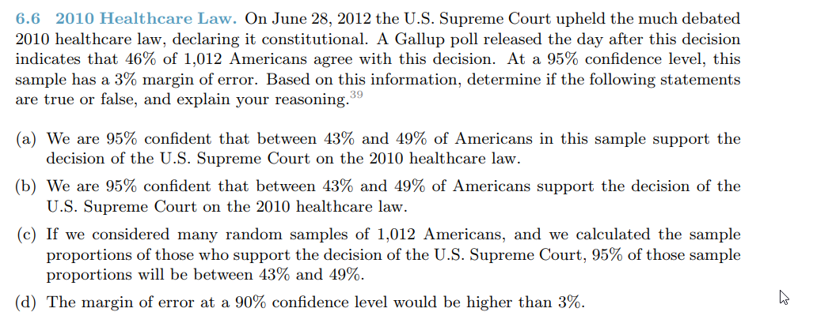
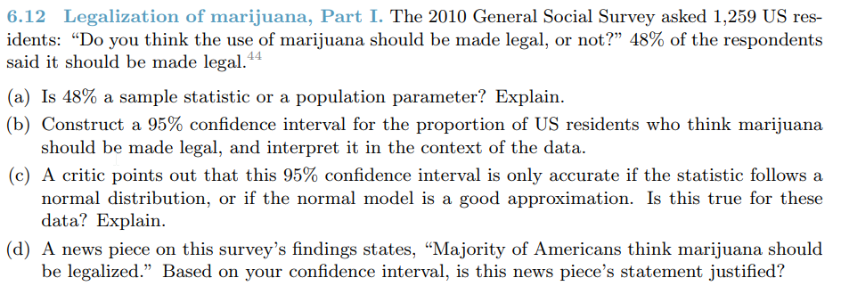
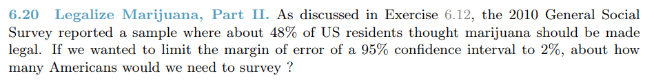
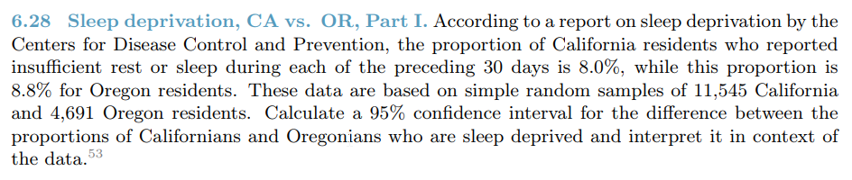
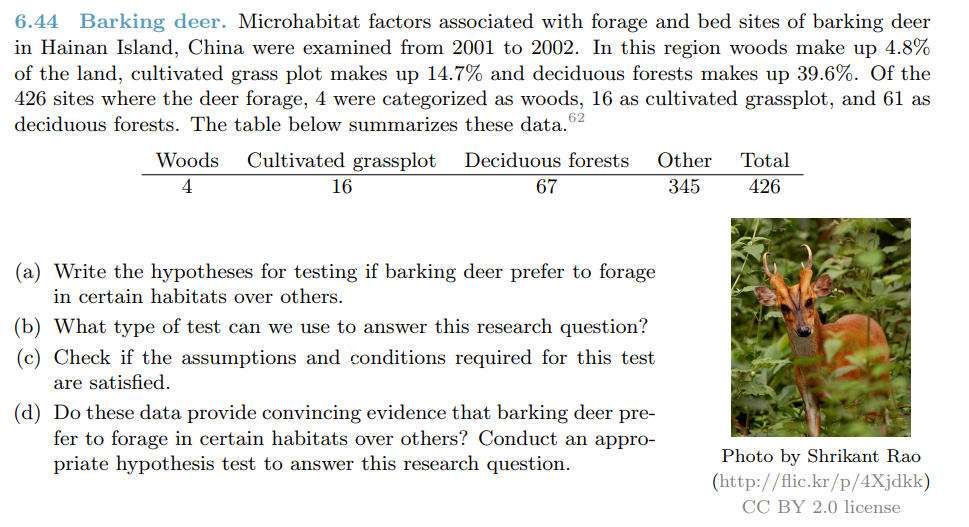
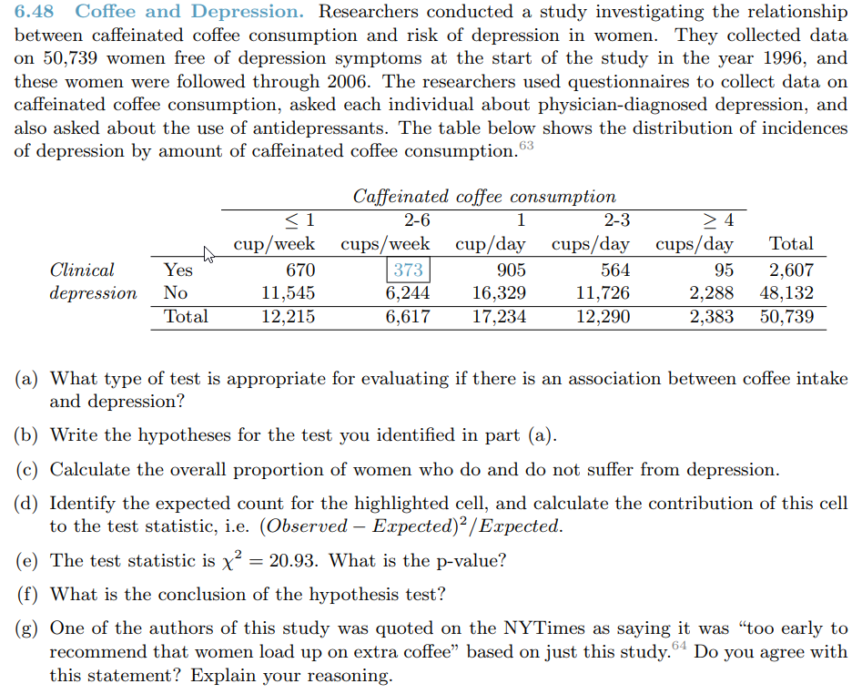

```{r setup, include=FALSE}
knitr::opts_chunk$set(echo = TRUE)
knitr::opts_chunk$set(warning = FALSE)
pkgs <- c("tidyverse", "magrittr", "kableExtra", "knitr")
lapply(pkgs, require, character.only=TRUE)
```

# Questions {.tabset .tabset-fade .tabset-pills}

## 6.6
1. 
  * a.) False. This is not the definition of a confidence interval. We are also given explicit metrics on the sample.
  * b.) True. This is the definition of a confidence interval. Assuming all the foundations of inference are met, this is the conclusion we would draw based on the information given.
  * c.) False. The confidence interval gives us conclusions about the entire population.
  * d.) False. Decreasing the confidence level would make the confidence interval narrower, making the margin of error decrease as well.

## 6.12
1. 
  * a.) 48% is a sample statistic. It was derived from the 1,259 sample of US residents.
  * b.)
```{r 6.12b}
n <- 1259
p <- .48
ci <- .95

se <- ((p * (1 - p)) / n) %>%
  sqrt
t <- qt(ci + (1 - ci)/2, n - 1)
me <- t * se

ci_int <- data_frame(lower = c(p - me), upper = c(p + me))
kable(ci_int, "html") %>%
  kable_styling(bootstrap_options = c("striped", "hover", "condensed", "responsive"))
```
  * c.) True. The sample observations are independent, the sample size is large enough, the the distribution is normal.
  * d.) Based on the confidence interval, the upper limit is barely above 50%. We cannot say that a "majority" of Americans feels marijuana should be legal.


## 6.20
1. 
```{r 6.20}
me <- .02
n <- ((p * (1 - p) * t^2) / (me ^ 2)) %>%
  print
```

## 6.28
1. 
```{r 6.28}
pCA <- .08
nCA <- 11545

pOR <- .088
nOR <- 4691

ci <- .95
pDelta <- pOR - pCA

# standard error
se <- (((pCA * (1 - pCA)) / nCA) + ((pOR * (1 - pOR)) / nOR)) %>%
  sqrt
z <- qnorm(ci + (1 - ci) / 2)

me <- z * se

# confidence interval
conf_inv <- data_frame(lower = c(pDelta - me), upper = c(pDelta + me))
kable(conf_inv, "html") %>%
  kable_styling(bootstrap_options = c("striped", "hover", "condensed", "responsive"))
```

## 6.44
1. 
  * a.) H0: The sites where the barking deer forage are distributed according to the below proportions.
  HA: The sites where the barking deer forage are different from the propotions below.
```{r 6.44a}
props <- data_frame(woods = c(.048), grass = c(.147), forest = c(.396), other = c(1 - .048 - .147 - .396))
```
  * b.) We can use the chi-square test since we have several group cases.
  * c.) We have to assume independence based on the lack of information in the description. Our samples all contain at least 5 expected cases satisfying the sample size condition.
  * d.) 
```{r 6.44d}
n <- 426
habs <- c(4, 16, 67, 345)
props <- c(.048, .147, .396, 1 - .048 - .147 - .396)

expected <- n * props

# chi square
chi <- ((habs - expected) ^ 2 / expected) %>%
  sum %>%
  print

# p value
p_chi <- (1 - pchisq(chi, df = length(habs) - 1)) %>%
  print
```
  The p_value = 0. Since the p value is < .001 and < .05, we reject the H0. There is enough evidence to support the claim that barking deer forage in certain habitates over others.

## 6.48
1. 
  * a.) The chi-squared test for two-way tables is appropriate for evaluation if there is a relationship between coffee intake and depression.
  * b.) H0: There is no association between caffeinated coffee consumption and depression. HA: There is an association between caffeinated coffee consumption and depression.
  * c.)
```{r 6.48c}
dep_table <- data_frame(depression = c('yes', 'no', 'total'), persons = c(2607, 48132, 2607 + 48132)) %>%
  mutate(proportion = persons / sum(c(2607, 48132)))

kable(dep_table, "html") %>%
  kable_styling(bootstrap_options = c("striped", "hover", "condensed", "responsive"))
```
  * d.) 

```{r 6.48d}
two_cup_total <- 6617
ek <- (dep_table$persons[dep_table$depression == 'yes'] * two_cup_total / dep_table$persons[dep_table$depression == 'total'])

chi <- (((373 - ek) ^ 2) / ek) %>%
  print
```
  * e.)
```{r 6.48e}
n <- 5
k <- 2

df <- (n-1)*(k-1)
chi <- 20.93

p <- (1 - pchisq(chi, df)) %>%
  print
```
  * f.) Since the p-value is below .05, we cannot reject the NULL hypothesis.
  * g.) I agree with this statement based on the chi-square test. There was no evidence of a relationship between coffee consumption and depression.
