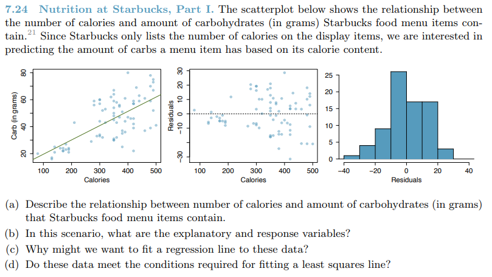
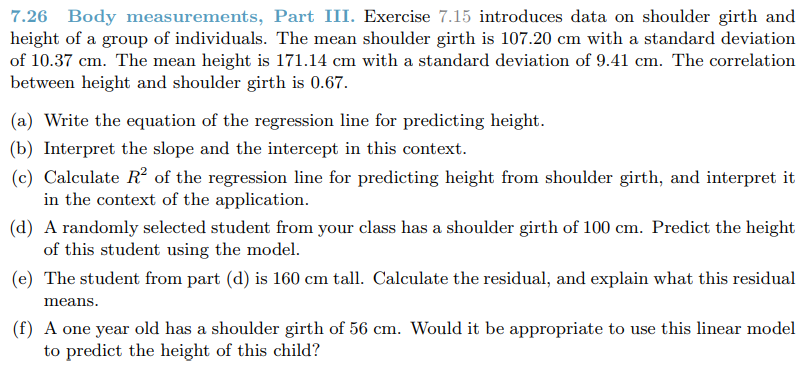
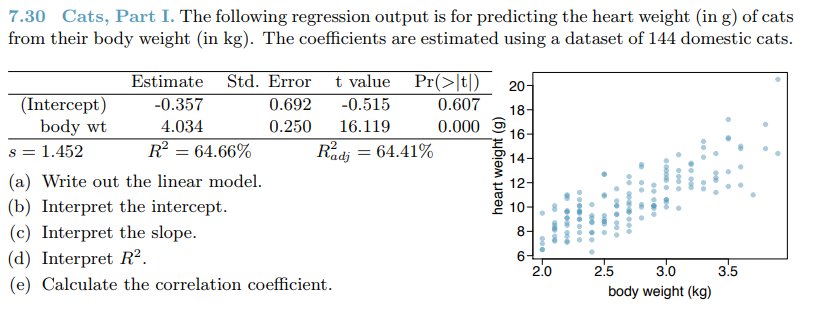
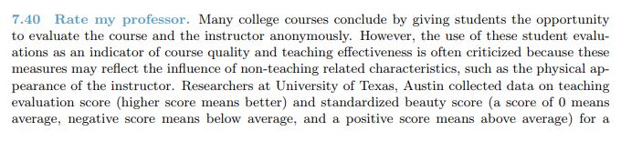
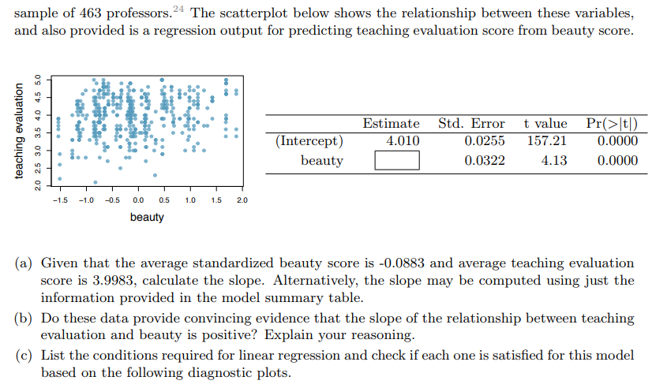
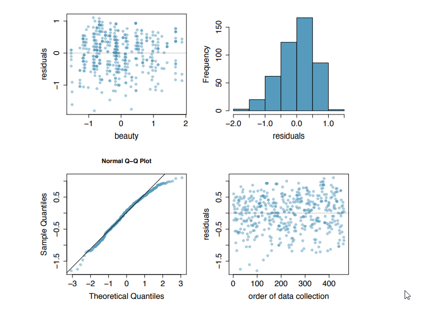

```{r setup, include=FALSE}
knitr::opts_chunk$set(echo = TRUE)
knitr::opts_chunk$set(warning = FALSE)
pkgs <- c("tidyverse", "magrittr", "kableExtra", "knitr")
lapply(pkgs, require, character.only=TRUE)
```

# Questions {.tabset .tabset-fade .tabset-pills}

## 7.24
1. 
  * a.) There appears to be a weak positive relationship between the number of calories and amount of carbohydrates as evidenced by the points in the scatter plot not residing close to the linear model
  * b.) The explanatory variable is Calories and the response variable is carbohydrates
  * c.) A regression line is able to help predict the amount of carbohydrates in a food item for which we know the calories. Even though the regression line is not a perfect fit to the data, it is still a decent predictor as opposed to no predictor
  * d.) Linearity: the data does appear to follow a linearly increased trend despite being dispersed around the regression line
        Normality: the distribution appears nearly normal
        Constant Variability: Based on the middle chart, the points seem to hover around zero but as calories increase, so do the residual spread.
        Conclusion: The data fails to meet the conditions for a least squares line


## 7.26
1. 
  * a.)
```{r}
xh <- 107.2
yh <- 171.14
sx <- 10.37
sy <- 9.41
r <- .67

# b1
b1 <- (sy/sx) * r

# b0
b0 <- yh - b1 * xh
```
Equation: y = `r b0` + `r b1` * x  
  * b.) Slope: represents the number of centimeters increase (`r b1`) in height for each increase in shoulder girth  
        Intercept: represents the height in centimeters at girth of 0cm (`r b0`)  
  * c.) The R2 is `r r^2` which means that `r paste(r^2 * 100, "%", sep = "")` of the variation is accounted for  
  * d.)
```{r}
height <- function(girth) b0 + b1 * girth
height(100)
```
  * e.)
```{r}
yi <- 160
ei <- (yi - height(100)) %>%
  print
```
Since the residual is negative, this means that the actual data point is below the result of the linear regression model and that the model is overstating the value
  * f.) It would not be appropriate. The original dataset had values within 85 and 135 cm. Extrapolation would be necessary here


## 7.30
1. 
  * a.) $\bar{y} = -.357 + 4.034x$
  * b.) The -.357 intercept means that at 0kg of body weight, the heart would weight -.357g - an impossible scenario
  * c.) The slope of 4.034 means that the heart's weight will increase by 4.034g for each 1kg of body weight
  * d.) An R^2 of 64.66% means that 64.66% of the variation is accounted for by the linear model
  * e.) The correlation coefficient is `r sqrt(.6466)`


## 7.40
1. 
1. 
1. 
  * a.)
```{r}
b0 <- 4.010

x <- -.0883
y <- 3.9983

b1 <- ((y - b0)/x) %>%
  print
```
  * b.) B1 > 0. For B1 to be >0, Sy and Sx must also be positive, therefore we can conclude the relationshpi between teaching evaluation and beauty will always be positive
  * c.) Linearity - there is no R^2 or correlation coefficient but there does appear to be a slightly linear positive relationship based on the scatterplot  
        Constant variance - the residuals look randomly scattered around 0 and meet the condition  
        Normal distribution - the data is slightly skewed left but otherwise very close to normal  
        Independence - is assumed based on the lack of evidence pointing either way. 463 is also much smaller than the 10% of population of professors nationwide