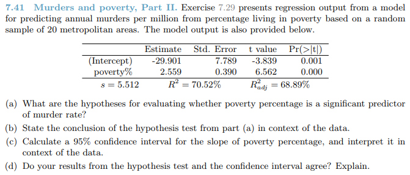

```{r setup, include=FALSE}
knitr::opts_chunk$set(echo = TRUE)
knitr::opts_chunk$set(warning = FALSE)
pkgs <- c("tidyverse", "magrittr", "kableExtra", "knitr")
lapply(pkgs, require, character.only=TRUE)
```

## 7.41


* a.)
    * $H_{0}$: The poverty percentage is not significant predictor of murder rate. $\beta_{1} = 0$
    * $H_{A}$: The poverty percentage is a significant predictor of murder rate. $\beta_{1} \neq 0$
* b.) Based on the summary chart above, the null hypothesis should be rejected. A Pr value of 0 indicates that its highly the poverty predictor is chance
* c.) The confidence interval means that for each increase in one percent in poverty, the increase in murders per million will be within the range or 1.74 and 3.38, with 95% confidence.
```{r 7.41c}
ci_u <- 2.559 + (qt(.975, df = 18) * .39)
ci_l <- 2.559 - (qt(.975, df = 18) * .39)

list(ci_u, ci_l)
```
* d.) The results do agree with the hypothesis test. The CI does not cross zero which also means that poverty is a predictor of murder rate