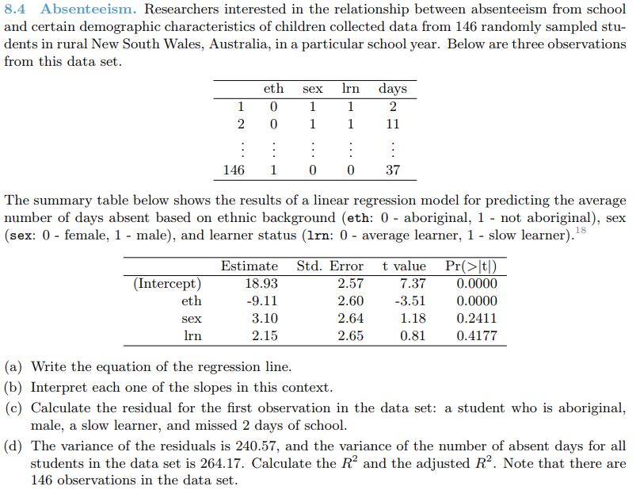

```{r setup, include=FALSE}
knitr::opts_chunk$set(echo = TRUE)
knitr::opts_chunk$set(tidy = TRUE)
knitr::opts_chunk$set(warning = FALSE)

libs <- c("tidyverse", "magrittr", "knitr", "kableExtra", "formatR")

loadPkg <- function(x) {
  if(!require(x, character.only = T)) install.packages(x, dependencies = T)
  require(x, character.only = T)
}

lapply(libs, loadPkg)
```

# Questions {.tabset .tabset-fade .tabset-pills}

## 8.2
1. 
  * a.) Equation: $\hat{y} = 120.07 - 1.93 * parity$
  * b.) The slope of -1.93 means that for every 1 increase in parity, the birth weight decrease by 1.93 ounces
```{r}
birth_weight <- function(parity) 120.07 - 1.93 * parity
kable(data_frame(child = 0:3, weight = map_dbl(0:3, birth_weight)))
```  
  * c.) The p-value is .0152; we can conclude that there is not a statistically significant relationship between birth weight and parity


## 8.4
1. 
  * a.) Equation: $\hat{y} = 18.93 - 9.11 * eth + 3.10 * sex + 2.15 * lrn$
  * b.) eth: number of days absent decreases by 9.11 when eth increases by 1 (goes from aboriginal to not aboriginal)
        sex: number of days absent increases by 3.10 when sex increases by 1 (goes from female to male)
        lrn: number of days absent increases by 2.15 when lrn increases by 1 (goes from avg learner to slow learner)
  * c.)
```{r}
days_absent <- function(eth, sex, lrn) 18.93 - 9.11 * eth + 3.10 * sex + 2.15 * lrn
actual <- 2
prediction <- days_absent(0, 1, 1)

residual <- (actual - prediction) %>%
  print
```
  * d.)
```{r}
n <- 146
k <- 3

varResidual <- 240.57
varStudents <- 264.17

r2 <- 1 - (varResidual/varStudents)
adjR2 <- 1 - (varResidual/varStudents) * ((n-1)/(n-k-1))
```  

$R^2 = `r r2`$  

$R^2_{adj} = `r adjR2`$

## 8.8
1. 
The lrn variable should be removed from the model first because it has the highest adjusted R2.


## 8.16
1. 
  * a.) As temperature increases, the number of damaged rings seems to decrease
  * b.) The key components of the summary table include:
        intercept: At 11.6630 it means that when the temperature value is zero, the damaged O-rings will have a value of 11.6630
        slope: At -.2162, it means that as the temperature increases by 1, the damaged O-rings will decrease by .2162
        z value/p-value: indicate signifance. Temperature has a greater significance as its closer to 0
  * c.) $log_{e}\left( \frac{p_i}{1 - p_i} \right) = 11.6630 - .2162 * temperature$
  * d.) Based on the model, there will be a high chance of damaged rings under 50 degrees. Since O-rings are critical components to success, the concerns are justified


## 8.18
1. 
  * a.) 
```{r 8.18}
prob_dmg <- function(temp) {
  dmg_o <- 11.6630 - .2162 * temp
  p <- exp(dmg_o) / (1 + exp(dmg_o))
  return(round(p, 3))
}

# probabilities
temps <- seq(from = 51, to = 71, by = 2)
probs <- prob_dmg(temps)
df <- data_frame(temps, probs)
kable(df)
```  
  
  * b.)
```{r}
ggplot(df, aes(x = temps, y = probs)) +
  geom_point() +
  geom_smooth(method = "lm")
```  
  
  * c.) For a logistic regression, each predictor $x_i$ should be linearly related to its $log(p_i)$ and each outcome $Y_i$ should be independent of the other outcomes. Based on this, the conditions are met

